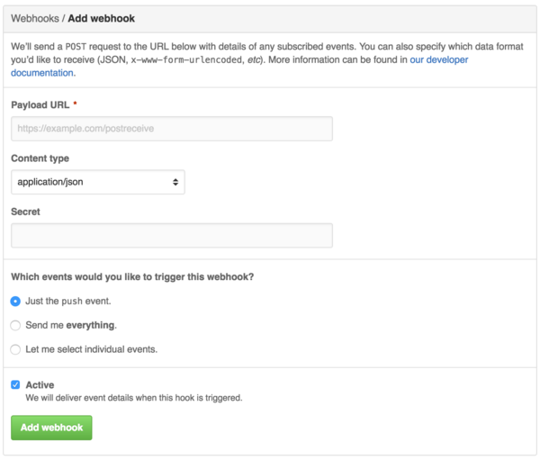
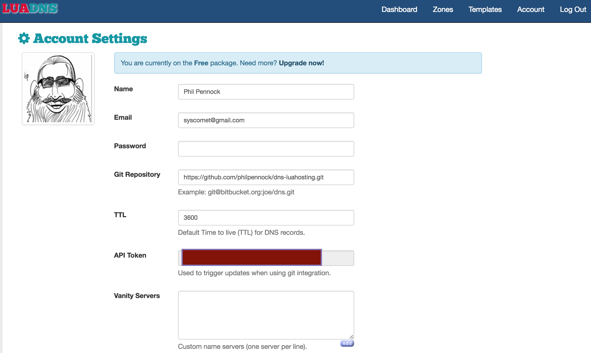

# Webhooks
## Theory & Practice

Phil Pennock  
Pennock Tech, LLC.

---

# Will cover:

* what webhooks are
* some examples of how they fit together
* good things to think about

Want: to get you thinking about the possibilities

---

# Webhooks are

* A contract to provide a push notification, to a URL of your choice
* Often with a useful payload
  + these days, usually JSON

That's it.

---

# Webhooks are

* A contract to provide a push notification, to a URL of your choice
* Often with a useful payload
  + these days, usually JSON

That's it.

* But recipients should be careful about trusting the payload
* the offerer might have to support multiple formats

---

# Let's make this real

.notes: so far, it's been abstract; if you already know about webhooks, that's great, but let's reify things for those who don't.

* Slack, GitHub, Jira
* IFTTT, Dropbox, LuaDNS
* Mail providers, Automatic, much more

---

# Cliché Example: GitHub → Slack

Precanned FIXME

---

# Example: Slack slash-command

Rather than let a service see everything happening in your Slack team, instead
add a `/command` which sends its arguments to the service as a webhook;
synchronous, with the results inserted into the conversation.

Simple example: wrote a `/uuid` command for $reasons

<https://gist.github.com/philpennock/773ecabd5445de5c9aaf>  
(Library dependency doesn't currently build, but can read the intent)

Use a library to hide the Slack details and potentially handle multiple chat
systems; put chat system into URL somewhere!

.notes: irony

.notes: `~/go/src/github.com/brettbuddin/victor% rm -rf pkg/chat/slackRealtime`

.notes: `vi robot.go` and disable import

---

# Example: DNS update on git push

* GitHub or Bitbucket hosting a repo with zonefile information therein
* A DNS provider who receive notifications of updates via webhook
* Access for the DNS provider to read the repository

LuaDNS: can provide zones in Bind format or written in Lua

<https://github.com/philpennock/dns-luahosting>

Caveat: no DNSSEC support with LuaDNS

---

# DNS / Git Setup 1

* Create a free account <https://api.luadns.com/signup>
* Created zone, `philpennock.net`
* At registrar (Gandi), repointed NS servers to LuaDNS's
* Created GitHub repo
    1. LuaDNS only lets you have one repo per account, each zone in files within
       that repo
    2. If using a personal GitHub account, you can't grant the `luadns` GH user
       read-only access, so either trust them with write access or use a public
       repo

[...]

---

# LuaDNS Screenshot

(To hide my API key from you)

---

# DNS / Git Setup 2

* GitHub: add webhook → https://api.luadns.com/notifications/${API_TOKEN:?}/push
* luadns.net: set the one git repo which is tied to the account:
    + https://github.com/philpennock/dns-luahosting.git
* write lua (or regular bind files), commit, push
* LuaDNS:
    + problem notifications via email, webhook always succeeds (asynchronous)
    + Provide HTTP redirect service, `ALIAS`, and others
    + can script helper functions

_Will demo an update live_

.notes: <https://api.luadns.com/zones>

.notes: <https://api.luadns.com/zones/39060>

.notes: `luadns-settings.png` to hide API key

.notes: `~/etc/dns/dns-luahosting`

.notes: discuss the async webhook, notifying system to try to update

.notes: could use `slave()` to set up secondarying, point NS elsewhere, and sign elsewhere, if trust path to luadns, but that somewhat defeats the point

---

# Plumbing

GitHub lets you send to multiple hooks. Not everyone is that good.  
Different receivers and senders might need hook munging.  
Run a plumbing layer to route messages!

Or use IFTTT: "IF This, Then That".  But be sure to understand their business model first.  
They support more than just webhooks.

---

# Misc ideas

* Using Jira?  Post to Slack whenever someone opens a ticket
    + <https://developer.atlassian.com/jiradev/jira-apis/webhooks>
* Working with people whose expertise is not computers and revision control?
  Using Dropbox?  Set up a webhook for "filesystem" notification, copy files
  automatically into revision control, add an easy intranet deploy system.
  <https://www.dropbox.com/developers/reference/webhooks>
* Want to act automatically on email?  Email providers sometimes use Sieve
  filtering, which has extension and notification mechanisms.  Clueful
  providers, like FastMail, use this:
  <https://beta.fastmail.com/help/technical/sieve-notify.html>; they don't
  support webhooks per se, but do support IFTTT, Pushover, Slack.  (If a
  paying customer, can always try asking for webhook support).

---

# Concept: Automatic to ...

Automatic provide an OBD-II dongle for cars

<https://developer.automatic.com/>

> The Automatic Events API sends your app real-time updates in response to
> driving events. Your app can respond to events like ignition on/off; hard
> brakes, accelerations, and speeding events; location changes; and even
> changes to the check engine light status.

<https://developer.automatic.com/api-reference/#using-websockets>

(No longer targeting consumers)

---

# Automatic ideas

1. When a trip finishes, always receive a Pushover mobile notification with
   details.
    * If it's your car, you probably then have lat/long for finding when parked
    * If car stolen, tracking yourself without commercial OnStar spooks
    * If you have teen drivers and are so inclined, might encourage them to
      start saving for their own car without your monitoring. ☺
    * If you run your own business, easier to account for expensible travel

---

# Automatic: payload of `trip:finished`

    !json
    {
      "id": "f61ba3d5-a68e-43eb-a731-0db871b4d3a3",
      "user": {
        "id": "U_ffd955ba63db5c25",
        "url": "https://api.automatic.com/user/U_ffd955ba63db5c25/"
      },
      "type": "trip:finished",
      "created_at": "2015-04-12T17:45:18.123Z",
      "time_zone": "America/Los_Angeles",
      "location": {
        "lat": 37.757076,
        "lon": -122.448120,
        "accuracy_m": 10,
        "created_at": "2015-04-12T17:45:01.123Z"
      },
      "vehicle": {
        "id": "C_507d6f1bd6d9b855",
        "url": "https://api.automatic.com/vehicle/C_507d6f1bd6d9b855/"
      },
      "device" : {
        "id": "021ac91c826b12eca99e685c"
      },
      "trip" {
        // Trip Object (matches REST API)
      }
    }

---

# Common Themes

* URL specified
* One, perhaps two, choices in content type
* Sender will sign payload, custom mechanism
* Often, content not trusted by receiver

---

# Concerns: Automatic

<https://developer.automatic.com/api-reference/#timeliness-amp-delivery>

> **Timeliness & Delivery**  
> Webhooks, by nature, do not guarantee delivery. Our implementation does
> not guarantee timeliness either. If your application requires 100%
> certainty about user data, we suggest also using the REST API and poll
> periodically and backfill any missed events. For most practical matters,
> however, the Websocket API and Webhook API should be more than
> sufficient.
>
> **Timeliness Caveats**  
> We will generally try to send an event when that event happens, in
> real-time. But in some cases events may fire much later, e.g. when an
> active internet connection is not available in an underground parking
> lot. In that case, a trip is uploaded to our servers only well after the
> trip took place. The associated `trip:finished` event would only be sent
> once our server received the trip, which could be hours or days later.
> If a user hasn't uploaded data for a while, we may end up sending many
> `trip:finished` events in rapid succession. It is imperative that your
> application inspect the timestamp of each event and react appropriately.
> In the case of `trip:finished`, e.g., this would be the embedded trip
> object's `started_at` and `ended_at` fields

---

# Sending webhooks from your service

* Figure out what are notifiable events
* What do your own systems trigger on?
* Do you already use a message queue system which lets multiple subscribers
  receive the same message

---

# Sending: concerns

* Will you send payload?
* Take per-hook secret configuration, for HMAC signing?
* How do you let folks resync?
* Reliability

---

# Some Links

* <https://developer.github.com/webhooks/>
* <https://developer.automatic.com/>

---

-------------------------------8< Talk Blurb >8-------------------------------
The talk will include:
• Some simple demos of how things fit together to achieve useful ends, 3 or so decent examples covering breadth. 
• Some very simple designs and an example of something working from them.
• Some common patterns.
• The leverage power tradeoffs in who speaks what data languages and how this influences webapp success.
• Things that need to be thought of around resilience, rate-limiting, and so forth. HTTPS, and verification. 
Authentication. Point towards token-based RBAC.
• Walk through something neat and current, pulling together the strands of the talk. 
-------------------------------8< Talk Blurb >8-------------------------------

Slack
Build notifications, etc
IFTTT
Email notifications -- ideal example; Sendgrid?  (but their Go example doesn't do what they say it does)

Fastmail via Sieve scripting!
  https://beta.fastmail.com/help/technical/sieve-notify.html
  use IFTTT

AWS Code Deploy
  https://github.com/integrations/aws-codedeploy

gitbook
  https://github.com/integrations/gitbook
  markdown / asciidoc

Pusher:
  push notifications for mobiles
  https://pusher.com/docs/webhooks

LGTM
  https://lgtm.co/docs/overview/

Atlas
  https://github.com/integrations/atlas
  The GitHub integration allows Atlas to automatically re-compile your
  applications and package them for deployment using Packer. This makes it
  easy to create Vagrant Boxes, AWS AMIs, Docker containers, etc

Authentication:
+ often just by having the secret for the URL as a token; password in the URL
+ optionally also HMAC signed content in a header
    * GitHub: X-Hub-Signature
    * Mandrill/Mailchimp: X-Mandrill-Signature
    * Trello: X-Trello-Webhook
    * Pusher: X-Pusher-Key / X-Pusher-Signature
    * LogEntries: Authorization: header using `LE` scheme
      + so doesn't play so well with proxies which tamper with authentication
+ authentication decided by poster, validated by receiver
  - if content format decided by poster, this works fine; if decided by
    receiver, you have N*M implementation variants to support

Proxies!

Where does the boundary between a general programming API and a webhook API
lay?
  Authorization: AWS _AWSAccessKeyId_:_Signature_
  https://docs.aws.amazon.com/AmazonS3/latest/dev/RESTAuthentication.html#ConstructingTheAuthenticationHeader

Boundary between a streaming API and a webhook?
  Streaming is usually one persistent connection; otherwise, it's outbound REST
  Streaming is usually defined as inbound, does auth, then turns around

Using a git hook to trigger a web action; `git help hooks`
  `post-receive` notifications (email, or webhook)
  `pre-receive` deciding whether someone allowed to push to a certain ref
  `update` deciding whether something is acceptable as an update (objects already stored, after pre-receive)

Push notifications to mobile:

  Amazon SNS
  Pushover: https://pushover.net/

---------------------------------8< stripe >8---------------------------------
You might use webhooks to:

Update a customer's membership record in your database when a subscription payment succeeds
Email a customer when a subscription payment fails
Check out the Dashboard if you see that a dispute was filed
Make adjustments to an invoice when it's created (but before it's been paid)
Log an accounting entry when a transfer is paid
---------------------------------8< stripe >8---------------------------------

<!-- vim: set sw=2 et : -->
