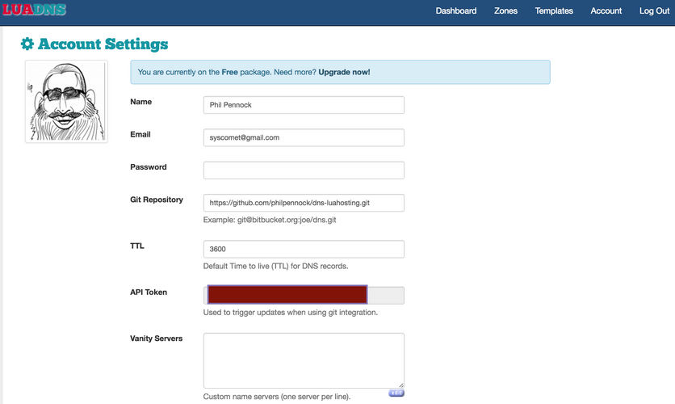

# Webhooks
## Theory & Practice

Phil Pennock  
Pennock Tech, LLC.

---

# Will cover:

* what webhooks are
* some examples of how they fit together
* good things to think about

Want: to get you thinking about the possibilities

---

# Webhooks are

* A contract to provide a push notification, via REST HTTP (`POST` method) to
  a URL of your choice, whenever "something" of interest happens at the sender
* Often with a useful payload
    + these days, usually JSON

That's it.

---

# Webhooks are

* A contract to provide a push notification, via REST HTTP (`POST` method) to
  a URL of your choice, whenever "something" of interest happens at the sender
* Often with a useful payload
    + these days, usually JSON

That's it.

* But recipients should be careful about trusting the payload
* the offerer might have to support multiple formats
* you might need to poll to backfill content
* sometimes, as a receiver, they just fall out of a general API

---

# Stripe

> You might use webhooks to:
>
> * Update a customer's membership record in your database when a subscription payment succeeds
> * Email a customer when a subscription payment fails
> * Check out the Dashboard if you see that a dispute was filed
> * Make adjustments to an invoice when it's created (but before it's been paid)
> * Log an accounting entry when a transfer is paid

---

# Let's make this real

.notes: so far, it's been abstract; if you already know about webhooks, that's great, but let's reify things for those who don't.

* Slack, GitHub, Jira
* IFTTT, Dropbox, LuaDNS
* Mail providers, Automatic, much more
* Pusher & Notify My Android (mobile notification); Amazon SNS

.notes: Content format between sender and receiver?  Who controls?  We'll revisit.

---

# Cliché Example: GitHub → Slack

Precanned FIXME

---

# Example: Slack slash-command

Rather than let a service see everything happening in your Slack team, instead
add a `/command` which sends its arguments to the service as a webhook;
synchronous, with the results inserted into the conversation.

Simple example: wrote a `/uuid` command for $reasons

<https://gist.github.com/philpennock/773ecabd5445de5c9aaf>  
(Library dependency doesn't currently build, but can read the intent)

Use a library to hide the Slack details and potentially handle multiple chat
systems; put chat system into URL somewhere!

.notes: irony

.notes: `~/go/src/github.com/brettbuddin/victor% rm -rf pkg/chat/slackRealtime`

.notes: `vi robot.go` and disable import

---

# Example: DNS update on git push

* GitHub or Bitbucket hosting a repo with zonefile information therein
* A DNS provider who receive notifications of updates via webhook
* Access for the DNS provider to read the repository

LuaDNS: can provide zones in Bind format or written in Lua

<https://github.com/philpennock/dns-luahosting>

Caveat: no DNSSEC support with LuaDNS

---

# DNS / Git Setup 1

* Create a free account <https://api.luadns.com/signup>
* Created zone, `philpennock.net`
* At registrar (Gandi), repointed NS servers to LuaDNS's
* Created GitHub repo
    1. LuaDNS only lets you have one repo per account, each zone in files within
       that repo
    2. If using a personal GitHub account, you can't grant the `luadns` GH user
       read-only access, so either trust them with write access or use a public
       repo

[...]

---

# LuaDNS Screenshot

(To hide my API key from you)

---

# DNS / Git Setup 2

* GitHub: add webhook → https://api.luadns.com/notifications/${API_TOKEN:?}/push
* luadns.net: set the one git repo which is tied to the account:
    + https://github.com/philpennock/dns-luahosting.git
* write lua (or regular bind files), commit, push
* LuaDNS:
    + problem notifications via email, webhook always succeeds (asynchronous)
    + Provide HTTP redirect service, `ALIAS`, and others
    + can script helper functions

_Will demo an update live_

.notes: <https://api.luadns.com/zones>

.notes: <https://api.luadns.com/zones/39060>

.notes: `luadns-settings.png` to hide API key

.notes: `~/etc/dns/dns-luahosting`

.notes: discuss the async webhook, notifying system to try to update

.notes: could use `slave()` to set up secondarying, point NS elsewhere, and sign elsewhere, if trust path to luadns, but that somewhat defeats the point

---

# Plumbing

GitHub lets you send to multiple hooks. Not everyone is that good.  
Different receivers and senders might need hook munging.  
Run a plumbing layer to route messages!

Or use IFTTT: "IF This, Then That".  But be sure to understand their business model first.  
They support more than just webhooks.

---

# Misc ideas

* Using Jira?  Post to Slack whenever someone opens a ticket
    + <https://developer.atlassian.com/jiradev/jira-apis/webhooks>
* Working with people whose expertise is not computers and revision control?
  Using Dropbox?  Set up a webhook for "filesystem" notification, copy files
  automatically into revision control, add an easy intranet deploy system.
  <https://www.dropbox.com/developers/reference/webhooks>
* Want to act automatically on email?  Email providers sometimes use Sieve
  filtering, which has extension and notification mechanisms.  Clueful
  providers, like FastMail, use this:
  <https://beta.fastmail.com/help/technical/sieve-notify.html>; they don't
  support webhooks per se, but do support IFTTT, Pushover, Slack.  (If a
  paying customer, can always try asking for webhook support).

---

# Concept: Automatic to ...

Automatic provide an OBD-II dongle for cars

<https://developer.automatic.com/>

> The Automatic Events API sends your app real-time updates in response to
> driving events. Your app can respond to events like ignition on/off; hard
> brakes, accelerations, and speeding events; location changes; and even
> changes to the check engine light status.

<https://developer.automatic.com/api-reference/#using-websockets>

(No longer targeting consumers)

---

# Automatic ideas

1. When a trip finishes, always receive a Pushover mobile notification with
   details.
    * If it's your car, you probably then have lat/long for finding when parked
    * If car stolen, tracking yourself without commercial OnStar spooks
    * If you have teen drivers and are so inclined, might encourage them to
      start saving for their own car without your monitoring. ☺
    * If you run your own business, easier to account for expensible travel
2. App or service which takes `ignition:on`, looks at the location data, looks
   at the location of your phone, and alarms or phones you if there's an
   apparent discrepancy.

---

# Automatic: payload of `trip:finished`

    !json
    {
      "id": "f61ba3d5-a68e-43eb-a731-0db871b4d3a3",
      "user": {
        "id": "U_ffd955ba63db5c25",
        "url": "https://api.automatic.com/user/U_ffd955ba63db5c25/"
      },
      "type": "trip:finished",
      "created_at": "2015-04-12T17:45:18.123Z",
      "time_zone": "America/Los_Angeles",
      "location": {
        "lat": 37.757076,
        "lon": -122.448120,
        "accuracy_m": 10,
        "created_at": "2015-04-12T17:45:01.123Z"
      },
      "vehicle": {
        "id": "C_507d6f1bd6d9b855",
        "url": "https://api.automatic.com/vehicle/C_507d6f1bd6d9b855/"
      },
      "device" : {
        "id": "021ac91c826b12eca99e685c"
      },
      "trip" {
        // Trip Object (matches REST API)
      }
    }

---

# Common Themes

* URL specified
* One, perhaps two, choices in content type
* Sender will sign payload, custom mechanism
* Often, content not trusted by receiver

---

# Concerns: Automatic

<https://developer.automatic.com/api-reference/#timeliness-amp-delivery>

> **Timeliness & Delivery**  
> Webhooks, by nature, do not guarantee delivery. Our implementation does
> not guarantee timeliness either. If your application requires 100%
> certainty about user data, we suggest also using the REST API and poll
> periodically and backfill any missed events. For most practical matters,
> however, the Websocket API and Webhook API should be more than
> sufficient.
>
> **Timeliness Caveats**  
> We will generally try to send an event when that event happens, in
> real-time. But in some cases events may fire much later, e.g. when an
> active internet connection is not available in an underground parking
> lot. In that case, a trip is uploaded to our servers only well after the
> trip took place. The associated `trip:finished` event would only be sent
> once our server received the trip, which could be hours or days later.
> If a user hasn't uploaded data for a while, we may end up sending many
> `trip:finished` events in rapid succession. It is imperative that your
> application inspect the timestamp of each event and react appropriately.
> In the case of `trip:finished`, e.g., this would be the embedded trip
> object's `started_at` and `ended_at` fields

---

# Sending webhooks from your service

* Figure out what are notifiable events
* What do your own systems trigger on?
* Do you already use a message queue system which lets multiple subscribers
  receive the same message

---

# Implementing local Git webhooks

Git has hooks, based on actions happening, run as commands.  They can do
whatever you want, based on the information available.  You can use shell and
`curl` to implement your own webhook sending.  Or you can be sane, post
information into a message queue, and let something else take care of retries
and so forth.

* `$ git help hooks`
* Sensible hooks for a repo on a server, in order:
    1. **`pre-receive`** deciding whether someone allowed to push to a certain ref (ACLs)
    2. **`update`** deciding whether something is acceptable as an update
        + objects already stored
        + synchronous call to a webhook
    3. **`post-receive`** for notifications, async (no ability to influence git, but can send messages to remote user)

---

# Build chain

Git repo hosters, following GitHub's lead, let you tie into the code merge
process quite extensibly via webhooks:

* Branch push triggering Continuous Integration tests
    + Results of tests visible in GitHub UI, to show failures, even block
      merges to master until status checks all pass
* Can implement code-review approval too, same mechanism, but comments on PR
  contain keywords used by webhook responder to decide whether to allow
    + LGTM: <https://lgtm.co/docs/overview/>
* Continuous Deployment:
    + Merge to master automatically triggering deploys, or image creation
      (Hashicorp Atlas managing Packer)
    + Some flows actually do this on branches and must deploy successfully to
      merge.
* Plus the usual Slack notifications.  Or ...
* Other build artifacts, other deployments?
    + GitBook for documentation updates

---

# Approval via Slack

1. Webhook on PR creation posts to service which posts to Slack (or does both
   in parallel)
2. Service uses <https://developer.github.com/v3/repos/statuses/> Statuses API
   to create a `pending` status
3. Service looks at `MAINTAINERS` file (like [LGTM](https://lgtm.co/)) and has
   service configuration mapping to GitHub identifiers (perhaps in-repo)
4. People LGTM on Slack in the special channel, or with a /slash-command
5. Service tracks approvals, uses GitHub authenticated API (not webhooks) to
   move the status to `failure` or `success`

Be sure to think about how to recover state after service restart.

---

# Sending: concerns

* Will you send payload?
* Take per-hook secret configuration, for HMAC signing?
* How do you let folks resync?
* Reliability
* Avoiding being a DDoS target
* Use `Referer:` to appear in logs with an identifier to help folks know
  someone requested this, and point to abuse desk?

---

# Content Format

If you're new, you're going to support common receivers yourself, and be able
to munge data to fit enough common schemas to be easy.

If you're big, you send in one format, have a few trusted partners who are
button-click integrations, and otherwise expect people to parse _your_ format.

Where does the boundary lie?  What's the reaction when you shift across?

Politics and power.

---

# Receiving: concerns

* You're receiving HTTP from the open Internet.  What do you do based on that?
* Ignore content, always take safe actions?  Securely poll authoritative
  source for real data?  How often?
* Rate-limits!  Especially if data is not valid
* **Always** require HTTPS, with valid certificate.
    + Some senders care about data privacy and also require HTTPS
* If accepting from specific services, implement verification for their sending authentication mechanism
* Secrets leak!  How do you handle rotation?
* Will you want multiple services to send to you?  With what content format?
  Design your URL namespace to include the sender service, or a name for the
  content?  Or just provide an API and make the sender munge their payload for
  you?

---

# Authentication

* often just by having the secret for the URL as a token; password in the URL
* optionally also HMAC signed content in a header
    + GitHub: `X-Hub-Signature:`
    + Mandrill/Mailchimp: `X-Mandrill-Signature:`
    + Trello: `X-Trello-Webhook:`
    + Pusher: `X-Pusher-Key:` / `X-Pusher-Signature:`
* LogEntries: `Authorization:` header using `LE` scheme
    + so doesn't play so well with proxies which tamper with authentication
    + This is a _receiver_, with a streaming API which lets low-volume stuff
      look like a webhook, but they dictate the format, so is it really a
      webhook?

_HMAC_: a hash which also covers a secret, in a way which prevents extension
attacks.

---

# Proxies!

The moment you offer an API over the Internet, you have to deal with folks
behind brain-dead corporate proxies which tamper with _everything_.  Minimize
the pain.

Commonly proxies tamper with website auth, not just proxy auth, even though
they "shouldn't".

If it's not a password and isn't an access token (ie, password), but is
something irreversibly derived (HMAC) so isn't morally a password, just put it
in another header.

---

# Boundaries?

Where does the boundary between a general programming API and a webhook API
lay?  As a receiver, it's mostly about who dictates the content format and
authorization.

Where does the boundary between a streaming API and a webhook offering lay, as
a sender?  Pretty much, volume and connection re-use.

Webhooks are always asynchronously fired by the service offering to send them,
not reacting to you asking "then" for events, but having configured a desire
for events (perhaps via an API).

Streaming APIs typically don't let you mutate state at the sender as part of
the stream, whereas webhooks with a synchronous response might do so.

Slack is a good example of a broad continuum.

Webhooks usually have the sender decide the authentication type and the
receiver has to implement code for each sender.  A service with an API
dictates the authentication type and senders need to implement it.

Thus intermediaries such as IFTTT (or your own).

---

# Fin

Phil Pennock  
GitHub: [@philpennock](https://github.com/philpennock)  
I'm on the Code&Supply Slack, best way to reach me non-urgently.  
Work: <mailto:phil@pennock-tech.com>

Some links:
* <https://developer.github.com/webhooks/>
* <https://developer.automatic.com/>
* <https://beta.fastmail.com/help/technical/sieve-notify.html>

<!--
• Things that need to be thought of around resilience, rate-limiting, and so forth. HTTPS, and verification. 
Authentication. Point towards token-based RBAC.
• Walk through something neat and current, pulling together the strands of the talk. 

-->

<!-- vim: set sw=2 et : -->
